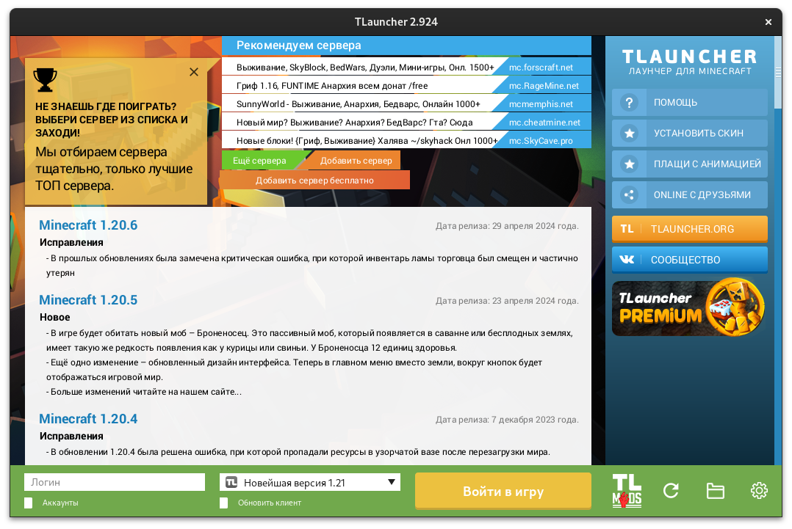

# TLauncher
**TLauncher** – это популярный альтернативный лаунчер Minecraft. Теперь в формате самодостаточного пакета Flatpak!

> [!NOTE]  
> Поскольку правила Flathub запрещают размещать приложения, позволяющие осуществлять незаконные действия, например пиратскую дейтельность, пакет не может быть принят сообществом.



## Порядок установки и использования
Инструкция подразумевает, что у вас имеются базовые навыки работы в Linux-среде, а в вашем дистрибутиве уже внедрена поддержка Flatpak.
1. Создайте директорию для хранения временных файлов процесса установки.
2. Откройте консоль из данной директории или перейдите в неё методом `cd`.
3. Если в вашей системе не установлен Git, воспользуйтесь этой [инструкцией](https://git-scm.com/download/linux) для установки.
4. Последовательно выполните следующие команды:
```
git clone https://github.com/DUB1401/TLauncher-Flatpak
flatpak install flathub org.flatpak.Builder -y
flatpak install flathub org.freedesktop.Sdk.Extension.openjdk21 -y
flatpak run org.flatpak.Builder --install --user build-dir org.tlauncher.TLauncher.json
```
5. Запустите приложение из штатного меню вашего репозитория.

_Copyright © DUB1401. 2024._